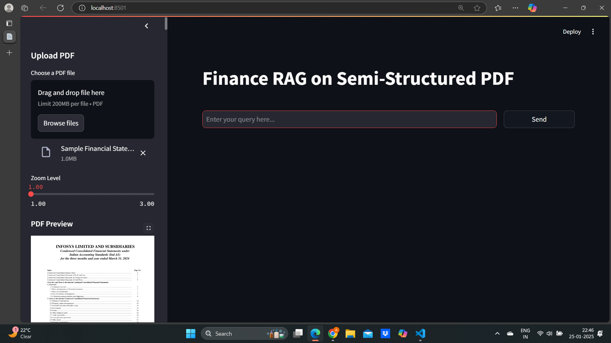

# RAG System for Financial Documents using Unstructured, Ollama (qwen2.5:3b, mxbai-embed-large), and ChromaDB

## Introduction
Handling financial documents poses several challenges due to their unstructured nature, which includes a mix of tabular data and text-based insights. Extracting meaningful information from these documents requires specialized processing techniques. 

In this project, we leverage 
-**Unstructured.io** to efficiently parse financial statements, 
-**Ollama** (qwen2.5:3b and mxbai-embed-large) for local language model inference, and vector embedding
-**ChromaDB** for vector-based storage and retrieval. 

The use of qwen2.5:3b over other models such as OpenAI is justified due to its superior numerical reasoning capabilities, local execution for enhanced security, and cost-effectiveness. ChromaDB is chosen for its efficient vector search and scalability.

---

## Project Assumptions, Setup, and Installation

### Assumptions
- The system is expected to process both tabular and textual data extracted from financial documents.
- Ollama provides offline inference capability, enhancing data privacy and security.
- Unstructured.io client API is used to extract structured content from PDFs.
- Minimum hardware requirements:
  - **CPU:** Quad-core processor
  - **RAM:** 16GB
  - **Storage:** SSD with at least 50GB free space
  - **GPU:** (Optional) NVIDIA GPU with 8GB VRAM for accelerated processing
- The environment assumes basic familiarity with Python and dependency management.

### Setup and Installation

1. **Setting up a Virtual Environment (Optional):**
   ```bash
   python -m venv rag_env
   source rag_env/bin/activate   # On Windows use: rag_env\Scripts\activate
   ```

2. **Install dependencies using `requirements.txt`:**
   ```bash
   pip install -r requirements.txt
   ```

3. **API Key Setup for Unstructured.io:**
   - Obtain an API key from [Unstructured.io](https://unstructured.io/)
   - Set the API key as an environment variable:
     ```bash
     export UNSTRUCTURED_API_KEY='your_api_key_here'  # On Windows use: set UNSTRUCTURED_API_KEY=your_api_key_here
     ```

4. **Ollama Installation:**
   - Download and install Ollama from the official website: [Ollama](https://ollama.ai)
   - Run the following command to pull the required models:
     ```bash
     ollama pull qwen2.5:3b
     ollama pull mxbai-embed-large
     ```

5. **Running the Application:**

   - **Start the FastAPI backend (run inside the project root directory):**
     
     ```bash
     uvicorn backend.main:app --host 127.0.0.1 --port 4892 --reload
     ```

   - **Start the Streamlit frontend:**
     
     ```bash
     streamlit run frontend/app.py
     ```

---

## Workflow of the Project

1. **Document Ingestion:** A financial statement PDF is uploaded.

2. **Data Extraction with Unstructured.io:**
    - Extracts data and categorizes into:
      - **Tabular Data** (structured financial figures).
      - **Text Data** (explanatory content).

3. **Summarization with LLM:**
    - Tabular data summarized for key insights.
    - Textual data summarized to highlight important aspects.

4. **MRV (Multi-Representation Vectorization):**
    - Processes extracted data into:
      - Raw table data
      - Raw text data

5. **User Query Processing:**
    - The system retrieves context from:
      - Raw and summarized tabular/textual data.
    - Forms an accurate response based on the query.

6. **Embedding Generation and Storage:**
    - Data transformed into embeddings and stored in ChromaDB and indexed for retrieval.
    
7. **Response Generation:**
    - The final response is presented to the user..

---

## Key Features of the Project

- **Secure Local Processing:**
  - Ollama enables running large language models locally, ensuring enhanced security for sensitive financial data.
  
- **Efficient Data Handling:**
  - Handles both tabular and unstructured textual data effectively.

- **Multimodal Support:**
  - Supports switching between different LLMs for diverse financial data tasks.

- **Cost-Effective Solution:**
  - Reduced operational costs by leveraging open-source models and local execution.

- **Scalability:**
  - ChromaDB provides efficient vector search, enabling fast retrieval for large datasets.

---

## Future Enhancements

1. **Reduction of Latency:**
   - Optimize model inference pipelines to reduce response time.
   
2. **Accuracy of Results:**
   - Fine-tune models with financial-specific datasets to improve precision.

3. **UI/UX Improvements:**
   - Develop an intuitive frontend for easier query submission and results visualization.

4. **Multilingual Support:**
   - Expand model capabilities to support multiple languages for broader applicability.

---

## Screenshots

### 1. Home Interface


### 2. Response Generation Example



---


```
